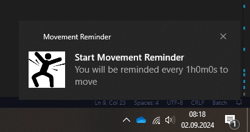

# movementreminder
momvementreminder is small helper tool written in go, which reminds you every hour to move. I use it for healthier office time.

## build
Build executable from windows using batch script ``build.bat``.

## execution
Start ``movementreminder.exe`` (a first start message wil appear). 
From then on, you will receive a reminder every hour.
It is created with no interface. To stop it, you have to kill the process using task manager.